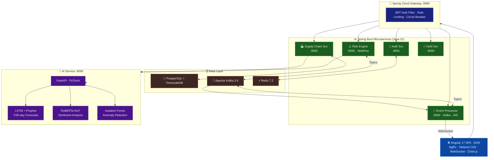

<div align="center">


# SupplySense AI
### Predictive Supply Chain Risk Intelligence Platform

*Enterprise-grade, cloud-native platform that predicts supply chain disruptions before they happen using advanced ML*

[](https://openjdk.org/projects/jdk/21/)
[](https://spring.io/projects/spring-boot)
[](https://angular.io)
[](https://python.org)
[](https://fastapi.tiangolo.com)
[](https://kafka.apache.org)
[](https://docker.com)
[](https://kubernetes.io)
[](LICENSE)

[🚀 Quick Start](#quick-start) · [📐 Architecture](#architecture) · [✨ Features](#features) · [📡 API Docs](#api-documentation) · [👨‍💻 Author](#author)

</div>

---

## 🎯 What is SupplySense AI?

SupplySense AI is a **production-grade supply chain risk intelligence platform** that combines real-time event streaming, predictive machine learning, and an intuitive Angular dashboard to give procurement and supply chain teams a 7–30 day warning before disruptions hit.

> Built as a portfolio project to demonstrate full-stack enterprise engineering across microservices, ML integration, and cloud-native deployment.

---

## ✨ Features

| Feature | Description |
|---|---|
| 🔴 **Real-time Risk Scoring** | Composite 0–100 risk score updated every 5 minutes via Kafka + WebSocket |
| 🤖 **Predictive ML** | 7-day and 30-day disruption forecasts using LSTM + Prophet ensemble |
| 📰 **News Sentiment Analysis** | RoBERTa NLP scanning 100,000+ news sources per supplier |
| 🔍 **Anomaly Detection** | Isolation Forest + Autoencoder for shipping metric anomalies |
| 🗺️ **Interactive Risk Map** | Global supplier heatmap with live score bubbles |
| 🔔 **Multi-channel Alerts** | Email, SMS, Slack, and in-app notifications with severity routing |
| 🎭 **What-If Scenarios** | Simulate port closures, tariff hikes, natural disasters and their impact |
| 📊 **Analytics Dashboard** | Risk distribution charts, trend lines, and supplier drill-down |
| 🔐 **Enterprise Auth** | JWT + Redis token blacklisting, RBAC, MFA-ready |

---

## 🏗️ Architecture



**Request Flow:**
1. **Angular 17 SPA** connects through HTTPS (REST) and WSS (WebSocket) for live risk score streaming
2. **Spring Cloud Gateway** validates JWTs, enforces per-IP rate limits, and trips circuit breakers on failures
3. **Supply Chain Service** manages supplier/product/route CRUD with TimescaleDB time-series caching
4. **Risk Engine** (WebFlux reactive) orchestrates composite 0–100 risk scores updated every 5 minutes
5. **AI Service** (FastAPI + PyTorch) runs LSTM + Prophet ensembles for 7-day and 30-day disruption forecasts
6. **RoBERTa NLP** scans 100K+ news sources per supplier for real-time sentiment signals
7. **Kafka** fan-out delivers risk events to the **Event Processor**, which bridges to WebSocket for the UI
8. **Redis** blacklists revoked JWT tokens and caches hot supplier scores for sub-millisecond reads

---
## 🚀 Quick Start

### Prerequisites
- Docker 24+ and Docker Compose v2
- 8 GB RAM minimum (16 GB recommended)

### One-command launch

```bash
git clone https://github.com/ravigithubcse/supplysense-ai.git
cd supplysense-ai/infrastructure/docker
docker compose up -d
```

### Access the stack

| Service | URL | Credentials |
|---|---|---|
| **Frontend** | http://localhost:4200 | admin@ss.ai / Admin1234! |
| **API Gateway** | http://localhost:8080 | — |
| **AI Service Docs** | http://localhost:8090/docs | — |
| **Kafka UI** | http://localhost:8180 | — |
| **Grafana** | http://localhost:3000 | admin / admin |
| **Kibana** | http://localhost:5601 | — |
| **Mailhog** | http://localhost:8025 | — |
| **MLflow** | http://localhost:5000 | — |

### Demo Accounts

```
Admin:   admin@ss.ai    / Admin1234!
Manager: manager@ss.ai  / Manager1234!
Analyst: analyst@ss.ai  / Analyst1234!
```

---

## 🛠️ Technology Stack

### Backend
| Layer | Technology |
|---|---|
| Language | Java 21 (Virtual Threads ready) |
| Framework | Spring Boot 3.2, Spring Security 6.2 |
| API Gateway | Spring Cloud Gateway 2023.0 |
| ORM | Spring Data JPA + Hibernate 6 |
| Migration | Flyway |
| Messaging | Apache Kafka 3.6 |
| Cache | Redis 7.2 |
| Auth | JWT (jjwt 0.12) + BCrypt |
| Docs | SpringDoc OpenAPI 3 |
| Metrics | Micrometer + Prometheus |

### AI / ML
| Layer | Technology |
|---|---|
| Language | Python 3.11 |
| Framework | FastAPI 0.109 + Uvicorn |
| Deep Learning | PyTorch 2.1 |
| NLP | HuggingFace Transformers (RoBERTa) |
| Forecasting | Prophet + LSTM ensemble |
| Anomaly Detection | Isolation Forest (scikit-learn) |
| Time Series | XGBoost |

### Frontend
| Layer | Technology |
|---|---|
| Framework | Angular 17 (Standalone Components) |
| State Management | NgRx 17 (Store + Effects + DevTools) |
| Styling | Tailwind CSS 3.4 |
| Real-time | STOMP over SockJS |
| Charts | Chart.js 4 |
| Maps | Mapbox GL 3 |
| HTTP | Angular HttpClient + Interceptors |

### Infrastructure
| Layer | Technology |
|---|---|
| Containers | Docker + Docker Compose |
| Orchestration | Kubernetes 1.29 |
| IaC | Terraform 1.7 (AWS EKS) |
| CI/CD | GitHub Actions |
| Monitoring | Prometheus + Grafana |
| Logging | ELK Stack (Elasticsearch + Kibana) |
| Tracing | Jaeger |
| Database | PostgreSQL 16 + TimescaleDB |

---

## 📡 API Documentation

All services expose Swagger UI:

```
http://localhost:8080/swagger-ui.html  # API Gateway
http://localhost:8081/swagger-ui.html  # Auth
http://localhost:8082/swagger-ui.html  # Supply Chain
http://localhost:8083/swagger-ui.html  # Risk Engine
http://localhost:8090/docs             # AI Service
```

### Key Endpoints

```http
POST /api/v1/auth/login                    # Authenticate
GET  /api/v1/suppliers?page=0&size=20      # List suppliers
GET  /api/v1/risk/scores                   # Latest risk scores
GET  /api/v1/risk/dashboard                # Dashboard KPIs
POST /api/v1/risk/scores/calculate         # On-demand risk calc
GET  /api/v1/risk/alerts?status=ACTIVE     # Active alerts
PATCH /api/v1/risk/alerts/{id}/resolve     # Resolve alert
POST /api/v1/risk/scenarios/what-if        # What-if simulation
POST /api/v1/predict/risk                  # AI risk prediction
GET  /api/v1/sentiment?supplierId=x        # News sentiment
```

---

## 🧪 Running Tests

```bash
# Backend (per service)
cd backend/auth-service && ./mvnw test

# AI service
cd ai-service && pytest tests/ -v --cov=app

# Frontend
cd frontend && npm test

# All backend services in parallel
for svc in api-gateway auth-service supply-chain-service risk-engine-service; do
  (cd backend/$svc && ./mvnw test -q) &
done
wait
```

---

## ☸️ Kubernetes Deployment

```bash
# Deploy to AWS EKS
cd infrastructure/kubernetes
kubectl apply -f base/namespace.yaml
kubectl apply -f base/deployments.yaml

# Check rollout
kubectl rollout status deployment/api-gateway -n supplysense
kubectl rollout status deployment/frontend -n supplysense
```

---

## 📁 Project Structure

```
supplysense-ai/
├── backend/
│   ├── api-gateway/          # Spring Cloud Gateway
│   ├── auth-service/         # JWT Authentication
│   ├── supply-chain-service/ # Supplier CRUD
│   ├── risk-engine-service/  # Risk orchestration + alerts
│   ├── event-processor-service/ # Kafka → WebSocket
│   └── notification-service/ # Multi-channel notifications
├── ai-service/               # FastAPI + ML models
│   ├── app/
│   │   ├── routers/          # predict, sentiment, anomaly
│   │   ├── services/         # model_registry (LSTM, RoBERTa, IF)
│   │   └── schemas/          # Pydantic request/response models
│   └── requirements.txt
├── frontend/                 # Angular 17 SPA
│   └── src/app/
│       ├── core/             # Services, guards, interceptors, models
│       └── features/         # dashboard, suppliers, risk-map, alerts, analytics
├── infrastructure/
│   ├── docker/               # docker-compose.yml + monitoring
│   └── kubernetes/           # K8s manifests
└── .github/workflows/        # GitHub Actions CI/CD
```

---


## 🏗️ Architecture


**Request Flow:**
1. **Angular 17 SPA** connects through HTTPS (REST) and WSS (WebSocket) for live risk score streaming
2. **Spring Cloud Gateway** validates JWTs, enforces per-IP rate limits, and trips circuit breakers on failures
3. **Supply Chain Service** manages supplier/product/route CRUD with TimescaleDB time-series caching
4. **Risk Engine** (WebFlux reactive) orchestrates composite 0–100 risk scores updated every 5 minutes
5. **AI Service** (FastAPI + PyTorch) runs LSTM + Prophet ensembles for 7-day and 30-day disruption forecasts
6. **RoBERTa NLP** scans 100K+ news sources per supplier for real-time sentiment signals
7. **Kafka** fan-out delivers risk events to the **Event Processor**, which bridges to WebSocket for the UI
8. **Redis** blacklists revoked JWT tokens and caches hot supplier scores for sub-millisecond reads

---
## 👨‍💻 Author

<div align="center">

### **Ravi Kumar**
*Full-Stack Software Engineer | AI-Integrated Product Development*

[](https://github.com/ravigithubcse)
[](https://linkedin.com/in/ravi-kumar)
[](mailto:ravi@example.com)

</div>

| | |
|---|---|
| 🎓 **Education** | B.E. Computer Science & Engineering, 2024 — CGPA **8.96** |
| 📍 **Location** | Bengaluru, India — **Immediately Available** |
| 💼 **Experience** | 1.5 years professional experience (Product Engineer) |
| 🛠️ **Core Stack** | Java · Spring Boot · Angular · Kafka · Redis · Docker · AWS |
| 🏆 **HackerRank** | Active competitive programmer |
| 📜 **Certifications** | Udemy, JSpiders — Full Stack & Cloud |

### Why I built SupplySense AI

This project demonstrates my ability to architect and deliver a **complete enterprise system** from scratch — spanning microservices design, real-time event streaming, ML model integration, a production Angular SPA, and cloud-native deployment. Every component reflects real engineering decisions I would make on the job.

> 🤝 **Open to roles in:** Product Engineering · Backend Engineering · Full-Stack Development · Java/Spring Boot · Angular · Bengaluru (on-site or hybrid)

### Other Portfolio Projects

| Project | Stack | Description |
|---|---|---|
| [adaptiveflow-ai](https://github.com/ravigithubcse/adaptiveflow-ai) | Spring Boot + Angular + AI | Adaptive workflow automation platform |
| [civicshield-ai](https://github.com/ravigithubcse/civicshield-ai) | Java + ML | Civic issue detection and routing |
| [SkillSync-AI](https://github.com/ravigithubcse/SkillSync-AI) | Spring Boot + NLP | AI-powered skill gap analysis tool |

---

<div align="center">

**⭐ Star this repo if it helped you · 🍴 Fork it · 📬 Reach out for collaboration**

*Built with ❤️ and lots of ☕ by Ravi Kumar*

</div>
